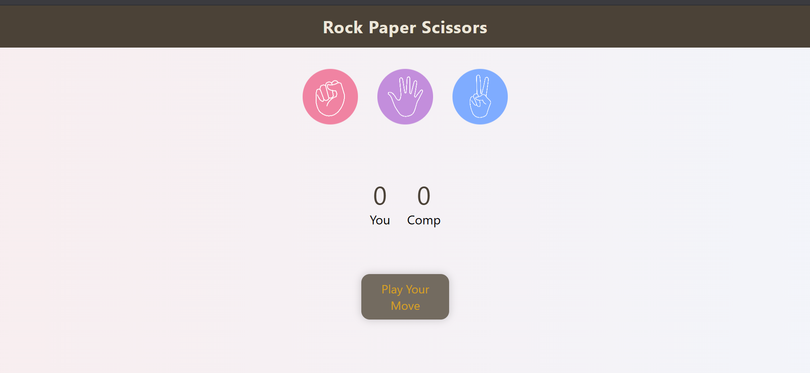

# 🪨 Rock Paper Scissors Game 🎮

A fun and interactive **Rock Paper Scissors** game built using **HTML, CSS, and JavaScript**, designed with smooth UI, animations, and full mobile responsiveness. This project is a great demonstration of frontend skills, DOM manipulation, and responsive design .

---

## 📌 Features

- 🎨 Clean & minimal UI with animated background
- ✨ Interactive hover + floating effects on game choices
- 📱 Fully responsive design (mobile, tablet, desktop)
- 🧠 Dynamic gameplay with computer AI
- 📊 Real-time score tracking
- 💬 Message display based on result (win/lose/draw)

---

## 📂 Project Structure

Rock-Paper-Scissors/
│
├── index.html # Main HTML structure
├── minigame.css # Styling and animations
├── minigame.js # Game logic & interactions
└── media/
├── rock.png
├── paper.png
└── scissors.png


---

## 🚀 How It Works

- The player selects **Rock**, **Paper**, or **Scissors**.
- The computer randomly chooses its move.
- The game compares both selections and:
  - Updates the score (user or computer)
  - Displays the result with a message (`You Win`, `You Lose`, or `Draw`)
- Game continues until browser is refreshed.

---

## 🛠️ How to Run This Project

> You don’t need any installations or dependencies!

### ✅ Run Locally
1. Clone this repository:
   ```bash
   git clone https://github.com/Arsh-pixel-cmd/Rock-Paper-Scissors-Game.git
   cd rock-paper-scissors

2. Open index.html in your browser.

## 💡 What You Learn from This Project

- DOM manipulation in JavaScript  
- Responsive layouts with Flexbox  
- Hover & animation effects in CSS  
- Basic AI logic (random choice generation)  
- Event handling & user interaction  
- Clean code and UI design principles  

---

## 🔍 Screenshots

| Game Interface|
|--------------------------------------------------------------|
| |


---

## 🎯 Ideal For

- Frontend Developers  
- Web Development Students  
- Beginners in JavaScript  
- Those building a portfolio for tech jobs/internships  

---

## 🧩 Topics Covered

- `HTML5`  
- `CSS3`  
- `JavaScript ES6`  
- `Responsive Design`  
- `Flexbox`  
- `DOM Events`  
- `CSS Animations`  

---

## 🙋‍♂️ Author

**Arsh Mishra**  
Frontend Developer & Tech Enthusiast  
[LinkedIn](https://www.linkedin.com/in/arsh-mishra-030093325/) | [GitHub](https://github.com/Arsh-pixel-cmd)

---

## 📃 License

This project is open-source under the [MIT License](LICENSE).

